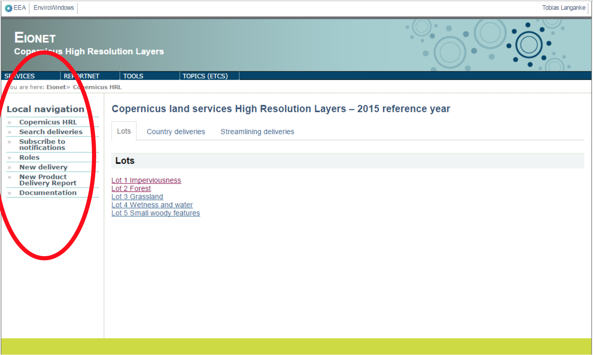
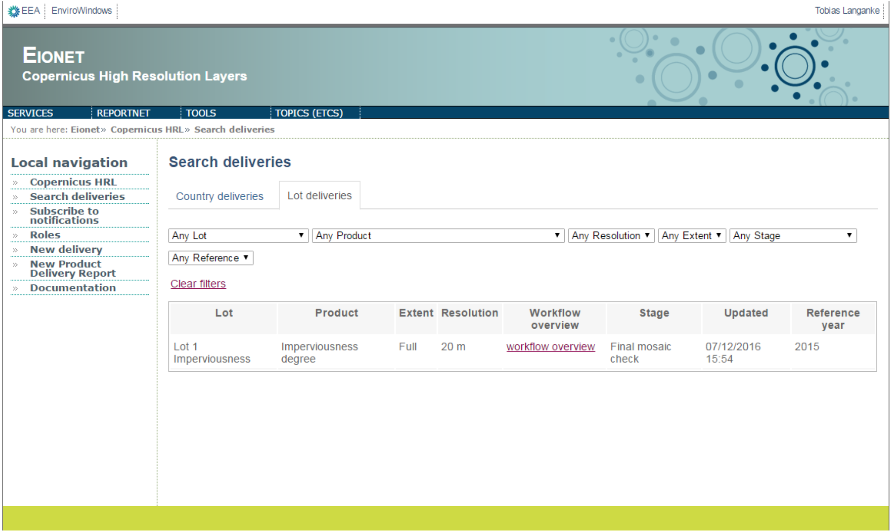
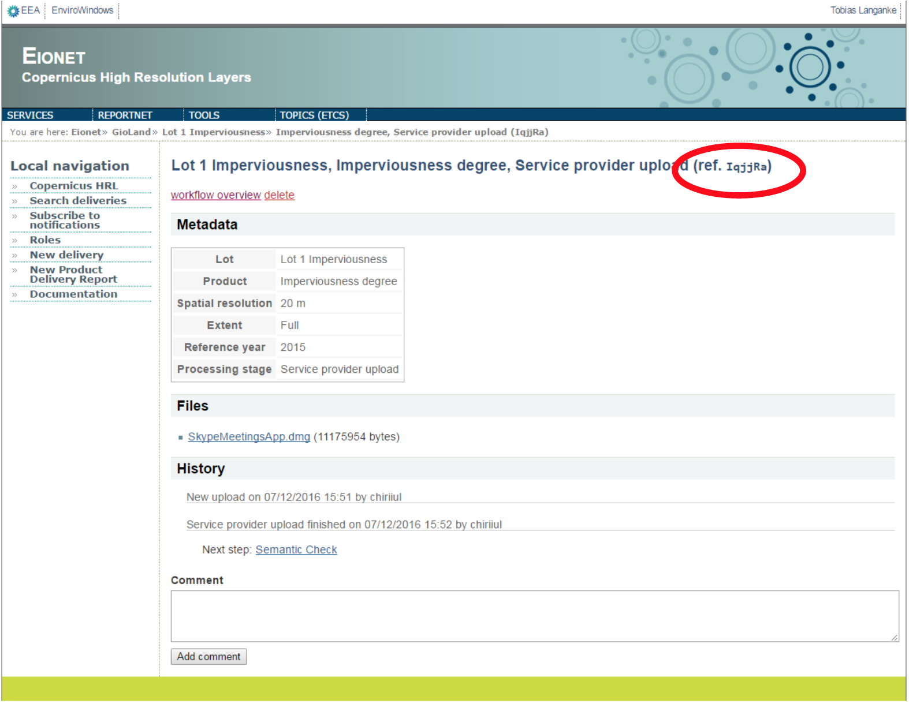
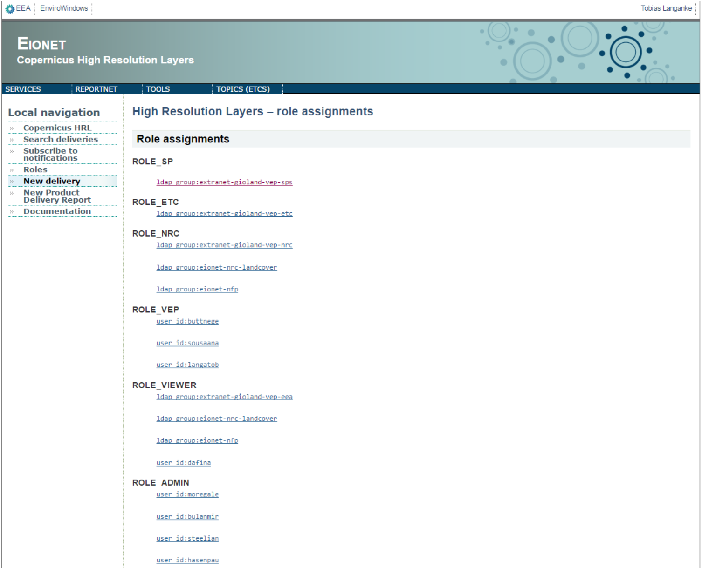
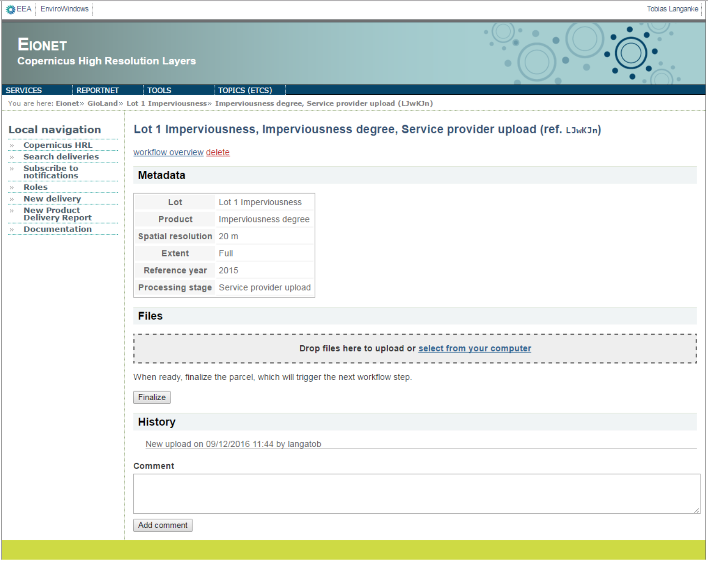
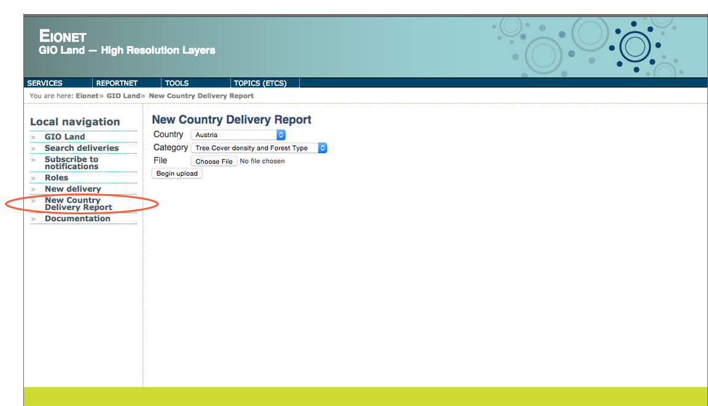
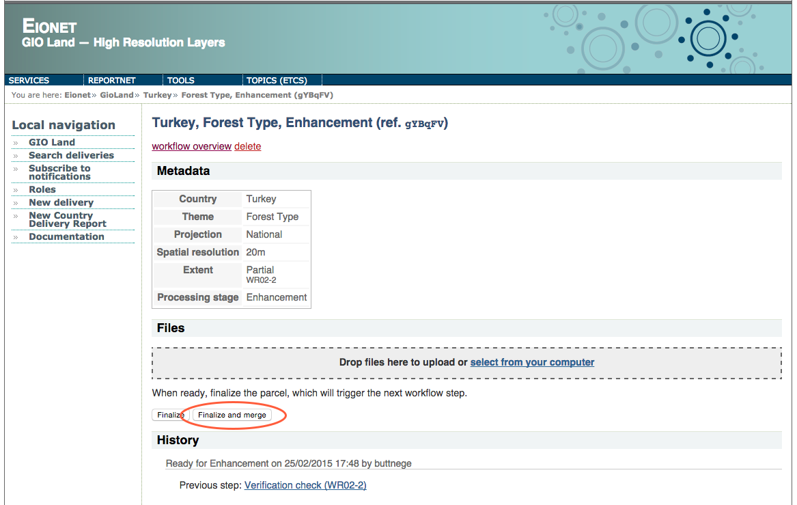
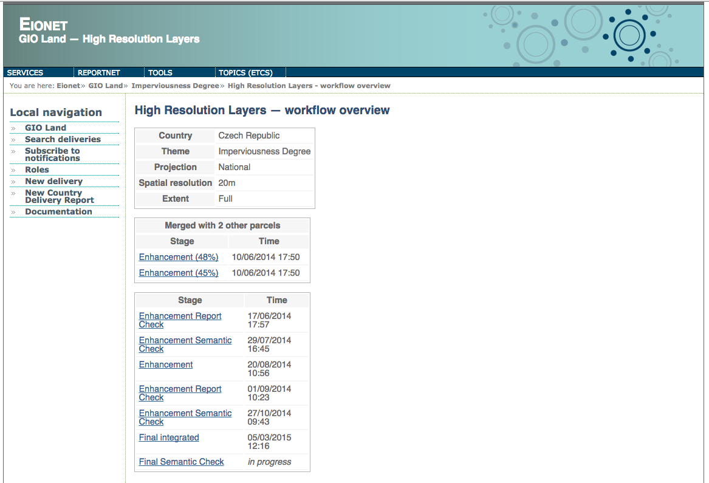
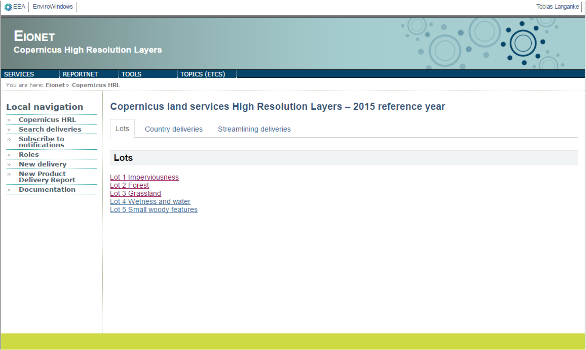

User Guide
==========

This section describes the functionality and interface of the portal. It is an EIONET system, and registered users can access the portal via their EIONET user account. Groups of Eionet users are assigned different ROLES, which determine the tasks that they can perform on the portal. For example, service providers need to be able to upload HRL data, so they are assigned to a role that permits that. Other users will not see that function enabled. To be registered and assigned to a specific role, contact the **EEA administrator**. Currently this is **Tobias Langanke (EEA NSV)**.

URL: https://gaur.eea.europa.eu/gioland/

.. image:: screenshots/homepage.png
   :width: 600px
   :target: _images/homepage.png

Login
~~~~~
Access restricted to GIO land stakeholder, via Eionet user account.

.. image:: screenshots/login-1.png
   :width: 600px
   :target: _images/login-1.png

Main page
~~~~~~~~~
Click on ‘GIO land’ to return to the main page from anywhere

.. image:: screenshots/login-2.png
   :width: 600px
   :target: _images/login-2.png

Local Navigation
~~~~~~~~~~~~~~~~
The Local navigation menu bar (left side of the page) accesses the main
portal functions:

Search deliveries
~~~~~~~~~~~~~~~~~

| Select ‘Search deliveries’ under Local navigation.
| This takes the user to a table of all deliveries made.
| Users can filter the table for deliveries of specific interest, based on country, theme, processing stage, etc., using the dropdown lists.
| The ‘stage’ field indicates the pending process in the verification and enhancement chain.
| The ‘workflow overview’ field is a hyper link to the processing stages of each HRL.

Clicking on the most recent ‘Service provider upload’ takes you to the page from where you can download the intermediate HRL.

Note that the workflow pages associate each action at each stage to the Eionet username of the user that performed it. This is accompanied by the time it was undertaken. This enables tracking of workflows in detail.

Each delivery is also associated with a unique code consisting of 6 random alpha-numeric characters. These unique codes match the folder name of the delivery on the server. See section on Administrator Guide for more details.

Subscribe to Notifications
~~~~~~~~~~~~~~~~~~~~~~~~~~
Notifications serve to inform users about verification and enhancement actions on HRLs that are of specific interest. E.g. many users will be interested only in specific countries or processing stages. Select the ‘Subscribe to notifications’ option under Local navigation.
Select the ‘Subscribe to notifications’ option under Local navigation.

This will open a dialogue which allows users to subscribe to receive HRL notifications. To receive all HRL notifications keep the default options, which are set to 'Any'. If the user prefers, they can filternotifications by Country, Theme, Extent, Projection, Spatial resolution, processing Stage and Event type. In this way, when HRL Verification and Enhancement activities matching these criteria occur, the user will receive a notification by email.

.. image:: screenshots/notifications-subscribe.png
   :width: 600px
   :target: _images/notifications-subscribe.png

Roles
~~~~~
The Verification and Enhancement portal is an Eionet role-based platform. HRL production, verification and enhancement are distinct processes involving stakeholders belonging to different categories (Service Providers, ETC, NRCs and EEA) distributed across Europe. They need a means of transferring data via internet protocols and they need a notification-based workflow monitoring system to enable them to carry out their respective roles effectively.

The four categories of users (stakeholders) are therefore grouped into Eionet LDAP groups:

* | Service providers
  | http://www.eionet.europa.eu/ldap-roles/?role_id=extranet-gioland-vep-sps
* | ETC
  | http://www.eionet.europa.eu/ldap-roles/?role_id=extranet-gioland-vep-etc
* | NRC/NFP
  | http://www.eionet.europa.eu/ldap-roles/?role_id=extranet-gioland-vep-nrc
  | http://www.eionet.europa.eu/ldap-roles/?role_id=eionet-nrc-landcover
  | http://www.eionet.europa.eu/ldap-roles/?role_id=eionet-nfp
* | EEA
  | http://www.eionet.europa.eu/ldap-roles/?role_id=extranet-gioland-vep-eea

These groups are assigned to different roles, which means that each can only carry out tasks specifically enabled for that group. Clicking on ‘Roles’ on the main page of the portal, under **Local navigation** takes you to a page which details these. Within the EEA, specified individuals are assigned to the roles ADMIN and VEP. The top part of this page indicates which stakeholders are assigned to which ROLE. The lower part indicates what tasks can be carried out by each of these ROLES.

The following figure illustrates just the top part of this page.

New delivery
~~~~~~~~~~~~
The ‘New delivery’ option is available only to Service Providers, allowing them to initiate the upload of a new Intermediate HRL or a Lot mosaic to the Verification and Enhancement portal. The workflows for these two categories are different. The former goes through the following stages:

* Service provider upload
* Sematic check
* Verification˚
* Verification check
* Enhancement
* Enhancement report check
* Enhancement semantic check
* Final integrated
* Final semantic check
* Final HRL

The Lot mosaics follow another workflow:

* Service provider upload
* Sematic check
* Final HRL Lot mosaic

DO NOT use this tool to re-submit intermediate HRLs that fail the Semantic Check stage.

New deliveries must be labelled by Country, Theme, Extent, Projection, Spatial resolution and Extent (full country coverage or partial coverage).

Select the criteria from the dropdown lists that match the HRL to be uploaded.

Clicking on the 'Begin Upload' button takes you to the upload page.

.. image:: screenshots/stage-new.png
   :width: 600px
   :target: _images/stage-new.png

Service Providers can drag and drop, or browse to select HRL files from their computers for upload.

When the HRL is uploaded, clicking on the 'Finalise' button will trigger the next workflow step and notifications will be sent to any users who have subscribed to receive them.

Users can add text in the Comment box if they choose.

File naming convention
~~~~~~~~~~~~~~~~~~~~~~

Please ensure that file names of deliveries adhere to the file-naming convention in the file entitled ‘filenameConvention_V4.pdf’

Delivery of Country Delivery Reports
~~~~~~~~~~~~~~~~~~~~~~~~~~~~~~~~~~~~

Use this dialogue to upload Country Delivery Reports. Note that there should be one report for both Forest HRL themes and one for both water categories.

Merging partial country workflows
~~~~~~~~~~~~~~~~~~~~~~~~~~~~~~~~~

**At the enhancement stage**, it is possible to merge multiple partial country HRL workflows if the data has been spatially merged during enhancement.

Click on ‘Finalize and Merge’ when uploading the data.

|
.. image:: screenshots/finalize-and-merge2.png
   :width: 600px
   :target: _images/finalize-and-merge2.png

When checking the workflow overview for that HRL you will see that partial HRLs have been merged.

The workflow histories of these merged parts are not lost, but remain as links on this page.

Logout
~~~~~~
Click on your name on the top right of the page, and then click the 'Log out' button.

