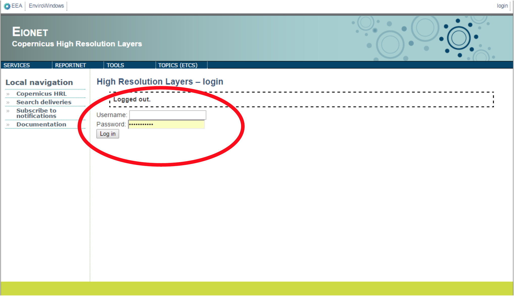
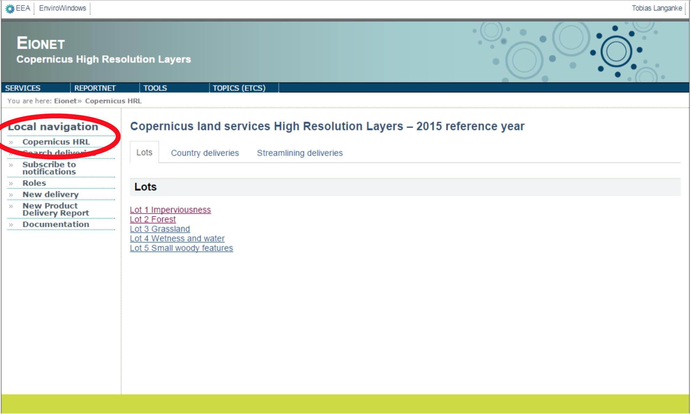
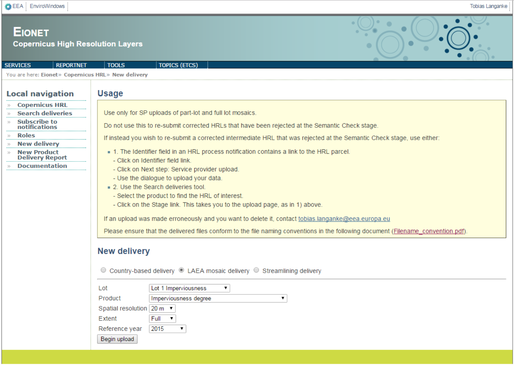
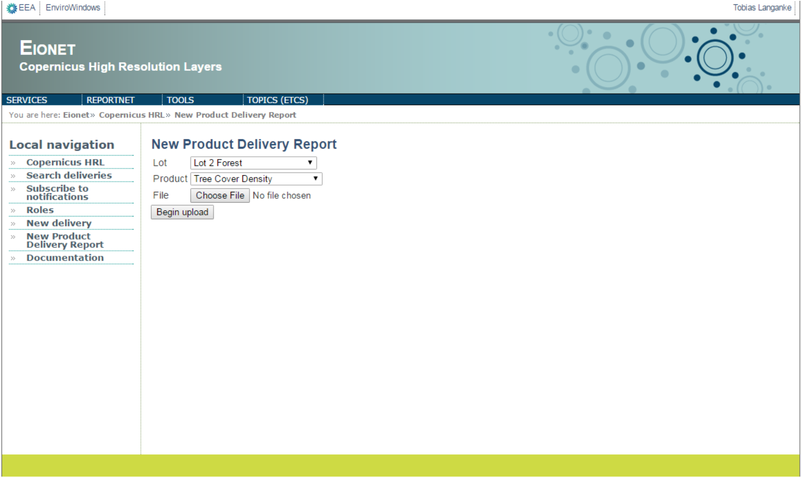

User Guide
==========

This section describes the functionality and interface of the portal. It is an
EIONET system, and registered users can access the portal via their EIONET user
account. Groups of Eionet users are assigned different ROLES, which determine
the tasks that they can perform on the portal. For example, service providers
need to be able to upload HRL data, so they are assigned to a role that permits
that. Other users will not see that function enabled. To be registered and
assigned to a specific role, contact the **EEA administrator**. Currently this
is **Tobias Langanke (EEA NSV)**.

URL: https://hrl-copernicus.eea.europa.eu

.. image:: screenshots/homepage.png
   :width: 600px
   :target: _images/homepage.png

Login
~~~~~
Access restricted to GIO land stakeholder, via Eionet user account.

Main page
~~~~~~~~~
Click on ‘COPERNICUS HRL’ to return to the main page from anywhere

Local Navigation
~~~~~~~~~~~~~~~~
The Local navigation menu bar (left side of the page) accesses the main
portal functions:

.. image:: screenshots/local-navigation.png
   :width: 600px
   :target: _images/local-navigation.png

Search deliveries
~~~~~~~~~~~~~~~~~

| Select ‘Search deliveries’ under Local navigation.
| This takes the user to a table of all deliveries made.
| Users can filter the table for deliveries of specific interest, based on country, theme, processing stage, etc., using the dropdown lists.
| The ‘stage’ field indicates the pending process in the verification and enhancement chain.
| The ‘workflow overview’ field is a hyper link to the processing stages of each HRL.

.. image:: screenshots/search-deliveries.png
   :width: 600px
   :target: _images/search-deliveries.png

Clicking on the most recent ‘Service provider upload’ takes you to the page
from where you can download the HRL.

Note that the workflow pages associate each action at each stage to the Eionet
username of the user that performed it. This is accompanied by the time it was
undertaken. This enables tracking of workflows in detail.

Each delivery is also associated with a unique code consisting of 6 random
alpha-numeric characters. These unique codes match the folder name of the
delivery on the server. See section on Administrator Guide for more details.

.. image:: screenshots/delivery.png
   :width: 600px
   :target: _images/delivery.png

Subscribe to Notifications
~~~~~~~~~~~~~~~~~~~~~~~~~~
Notifications serve to inform users about verification and enhancement actions
on HRLs that are of specific interest. E.g. many users will be interested only
in specific countries or processing stages. Select the ‘Subscribe to
notifications’ option under Local navigation.

This will open a dialogue which allows users to subscribe to receive HRL
notifications. To receive all HRL notifications keep the default options, which
are set to 'Any'. If the user prefers, they can filter notifications by
Country, Theme, Extent, Projection, Spatial resolution, processing Stage and
Event type. In this way, when HRL Verification and Enhancement activities
matching these criteria occur, the user will receive a notification by email.

.. image:: screenshots/notifications-subscribe.png
   :width: 600px
   :target: _images/notifications-subscribe.png

Roles
~~~~~
The Verification and Enhancement portal is an Eionet role-based platform. HRL
production, verification and enhancement are distinct processes involving
stakeholders belonging to different categories (Service Providers, ETC, NRCs
and EEA) distributed across Europe. They need a means of transferring data via
internet protocols and they need a notification-based workflow monitoring
system to enable them to carry out their respective roles effectively.

The four categories of users (stakeholders) are therefore grouped into Eionet
LDAP groups:

* | Service providers
  | http://www.eionet.europa.eu/ldap-roles/?role_id=extranet-gioland-vep-sps
* | ETC
  | http://www.eionet.europa.eu/ldap-roles/?role_id=extranet-gioland-vep-etc
* | NRC/NFP
  | http://www.eionet.europa.eu/ldap-roles/?role_id=extranet-gioland-vep-nrc
  | http://www.eionet.europa.eu/ldap-roles/?role_id=eionet-nrc-landcover
  | http://www.eionet.europa.eu/ldap-roles/?role_id=eionet-nfp
* | EEA
  | http://www.eionet.europa.eu/ldap-roles/?role_id=extranet-gioland-vep-eea

These groups are assigned to different roles, which means that each can only
carry out tasks specifically enabled for that group. Clicking on ‘Roles’ on the
main page of the portal, under **Local navigation** takes you to a page which
details these. Within the EEA, specified individuals are assigned to the roles
ADMIN and VEP. The top part of this page indicates which stakeholders are
assigned to which ROLE. The lower part indicates what tasks can be carried out
by each of these ROLES.

The following figure illustrates just the top part of this page.

.. image:: screenshots/roles.png
   :width: 600px
   :target: _images/roles.png

New delivery
~~~~~~~~~~~~
The ‘New delivery’ option is available only to Service Providers, allowing them
to initiate the upload of:

* A LAEA projection mosaic delivery (full lot or partial)
* A streamlining delivery (only relevant during streamlining phase and for lot
  3-5)
* A country based delivery in national projection at the end of production

The workflows for these three categories are different. The following table
summarizes the stages in the workflow, who has access, if file upload and
rejection is possible and what the reject stage will be.

+-----------------------+---------------------------------------------------------------------+-----------------------------+--------------------------------------------------------------+-------------------------------------------------------------------+---------------------------------------------------+
| Upload option         | Stage                                                               | Roles with access           | File upload possible                                         | Reject possible (*yes* enables the *Finalize and reject* button)  | Reject stage (following stage if parcel rejected) |
+=======================+=====================================================================+=============================+==============================================================+===================================================================+===================================================+
|                       | Service provider upload                                             | ROLE_SP ROLE_ADMIN          | yes                                                          | no                                                                | --                                                |
+                       +---------------------------------------------------------------------+-----------------------------+--------------------------------------------------------------+-------------------------------------------------------------------+---------------------------------------------------+
| LAEA mosaic delivery  | Validation sample check [only when uploaded as “partial” delivery]  | ROLE_ETC ROLE_ADMIN         | yes (validation report)                                      | yes                                                               | Service provider upload                           |
+                       +---------------------------------------------------------------------+-----------------------------+--------------------------------------------------------------+-------------------------------------------------------------------+---------------------------------------------------+
|                       | Semantic check                                                      | ROLE_ETC ROLE_ADMIN         | yes (semantic check report)                                  | yes                                                               | Service provider upload                           |
+                       +---------------------------------------------------------------------+-----------------------------+--------------------------------------------------------------+-------------------------------------------------------------------+---------------------------------------------------+
|                       | Final HRL                                                           | ROLE_SP ROLE_ADMIN          | yes (for full mosaics combining previous partial deliveries) | no                                                                | --                                                |
+                       +---------------------------------------------------------------------+-----------------------------+--------------------------------------------------------------+-------------------------------------------------------------------+---------------------------------------------------+
|                       | Final mosaic check                                                  | ROLE_ETC ROLE_ADMIN         | no                                                           | yes                                                               | Final HRL                                         |
+                       +---------------------------------------------------------------------+-----------------------------+--------------------------------------------------------------+-------------------------------------------------------------------+---------------------------------------------------+
|                       | Final HRL mosaic                                                    | ROLE_SP ROLE_ETC ROLE_ADMIN | no                                                           | no                                                                | --                                                |
+-----------------------+---------------------------------------------------------------------+-----------------------------+--------------------------------------------------------------+-------------------------------------------------------------------+---------------------------------------------------+
| Country delivery      | Service provider upload                                             | ROLE_SP ROLE_ADMIN          | yes                                                          | no                                                                | --                                                |
+                       +---------------------------------------------------------------------+-----------------------------+--------------------------------------------------------------+-------------------------------------------------------------------+---------------------------------------------------+
|                       | Final semantic check                                                | ROLE_ETC ROLE_ADMIN         | yes (semantic check report)                                  | yes                                                               | Service provider upload                           |
+                       +---------------------------------------------------------------------+-----------------------------+--------------------------------------------------------------+-------------------------------------------------------------------+---------------------------------------------------+
|                       | Final HRL                                                           | ROLE_SP ROLE_ADMIN          | no                                                           | no                                                                | --                                                |
+-----------------------+---------------------------------------------------------------------+-----------------------------+--------------------------------------------------------------+-------------------------------------------------------------------+---------------------------------------------------+
| Streamlining delivery | Service provider upload                                             | ROLE_SP ROLE_ADMIN          | yes                                                          | no                                                                | --                                                |
+                       +---------------------------------------------------------------------+-----------------------------+--------------------------------------------------------------+-------------------------------------------------------------------+---------------------------------------------------+
|                       | Streamlining check                                                  | ROLE_ETC ROLE_ADMIN         | yes (streamlining check report)                              | yes                                                               | Service provider upload                           |
+-----------------------+---------------------------------------------------------------------+-----------------------------+--------------------------------------------------------------+-------------------------------------------------------------------+---------------------------------------------------+

DO NOT use this tool to re-submit intermediate HRLs that fail the Semantic
Check stage. In these cases go directly to the workflow overview for the
product in which the semantic check failed. The pending stage here will now be
“service provider upload”, from which the re-upload should be inserted.

New deliveries must be labelled by lot, product, spatial resolution, extent and
reference year (for LAEA mosaic deliveries, in addition by country for country
deliveries).  Select the criteria from the dropdown lists that match the HRL to
be uploaded.  Clicking on the ‘Begin Upload’ button takes you to the upload
page.

Service Providers can drag and drop, or browse to select HRL files from their
computers for upload.  When the HRL is uploaded, clicking on the ‘Finalize’
button will trigger the next workflow step and notifications will be sent to
any users who have subscribed to receive them.

.. image:: screenshots/comment.png
   :width: 600px
   :target: _images/comment.png

Users can add text in the Comment box if they choose, this is particularly
useful if there are special issues with the delivery in question that need
documentation.

File naming convention
~~~~~~~~~~~~~~~~~~~~~~

Please ensure that file names of deliveries adhere to the file-naming
convention in the file entitled :download:`HRL file naming convention.pdf <../static/doc/filenameConvention.pdf>`

Delivery of Product Delivery Reports
~~~~~~~~~~~~~~~~~~~~~~~~~~~~~~~~~~~~

Use this dialogue to upload Product Delivery Reports.

Logout
~~~~~~
Click on your name on the top right of the page, and then click the 'Log out'
button.

.. image:: screenshots/logout.png
   :width: 600px
   :target: _images/logout.png
