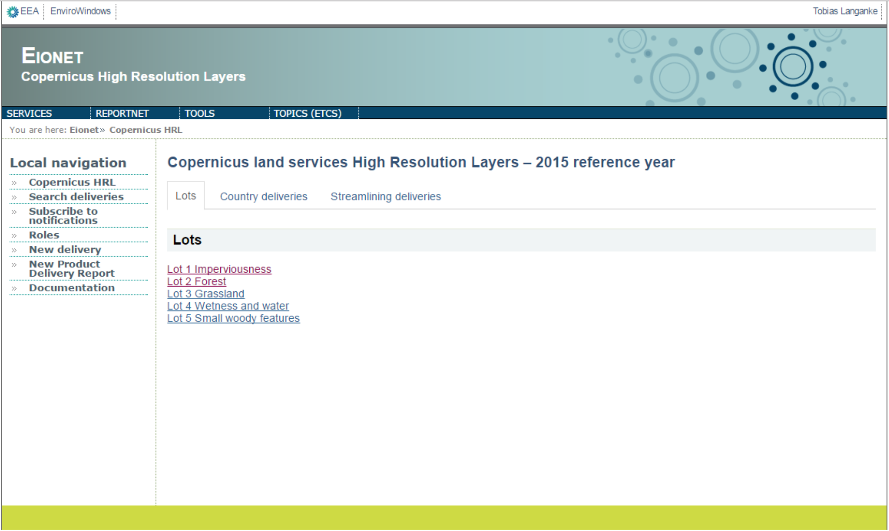
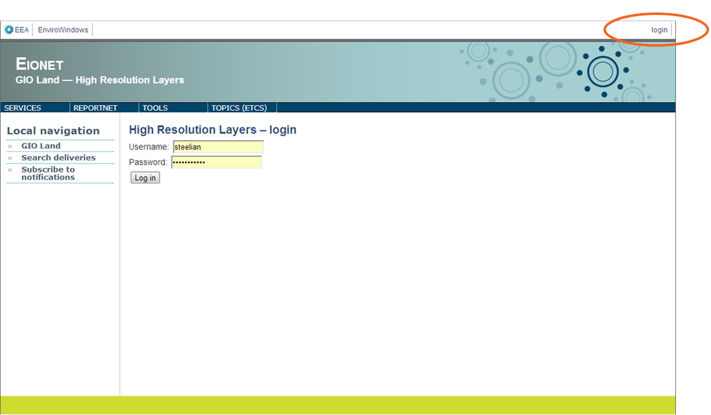
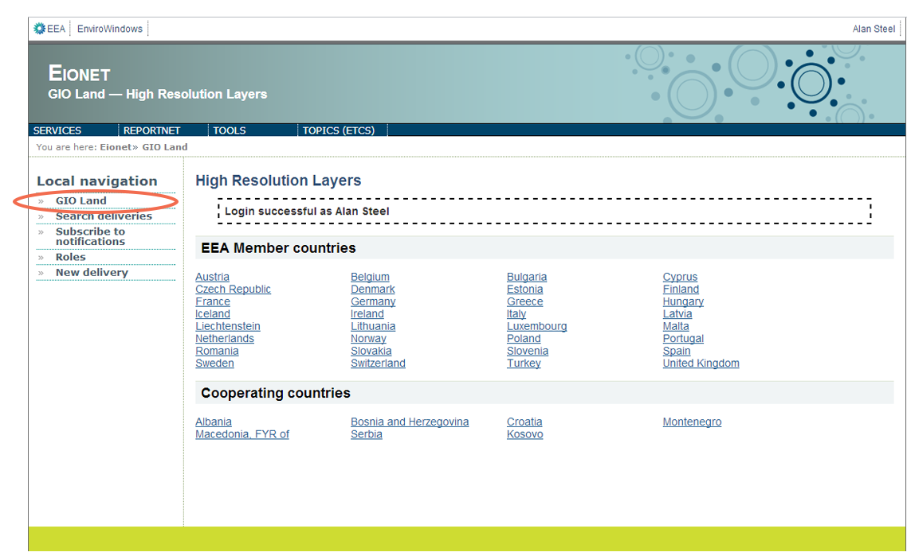
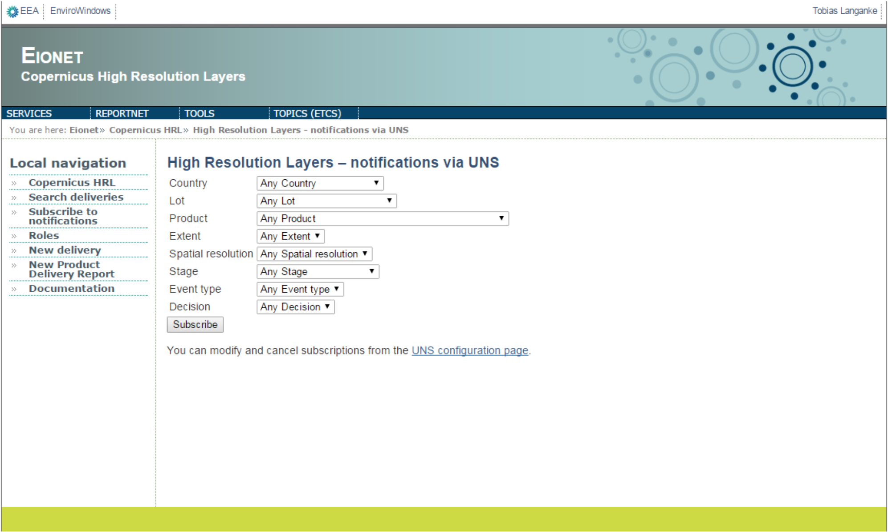
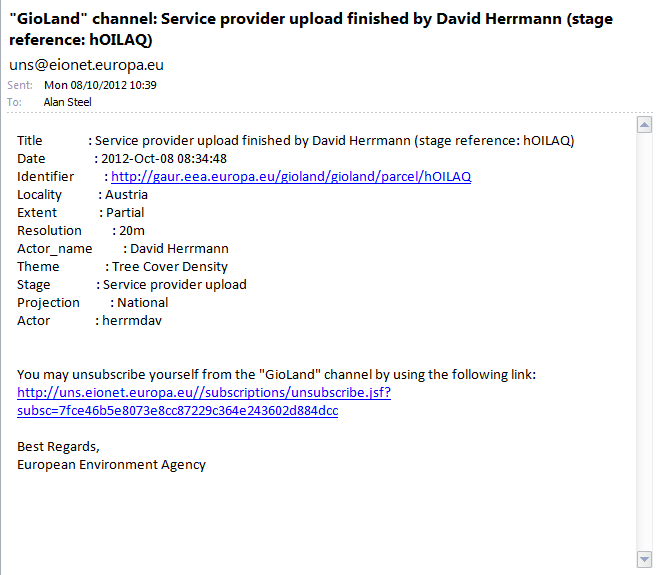
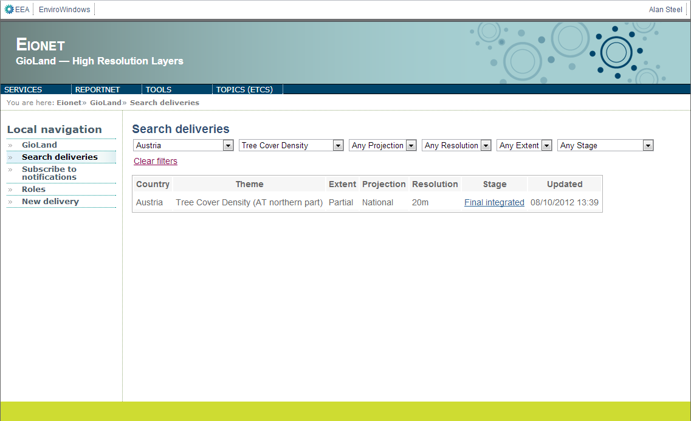
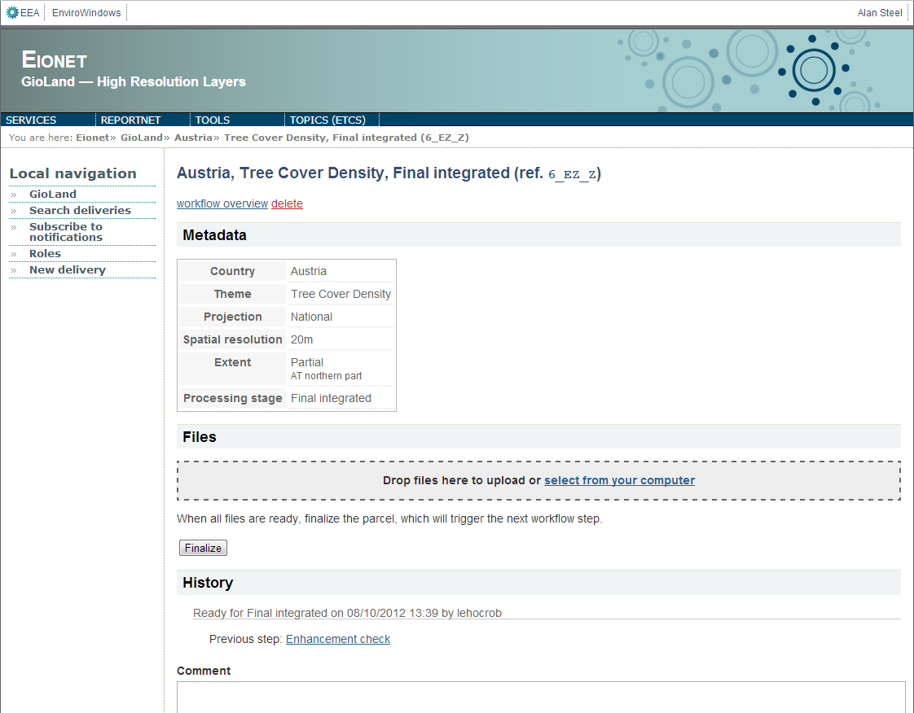
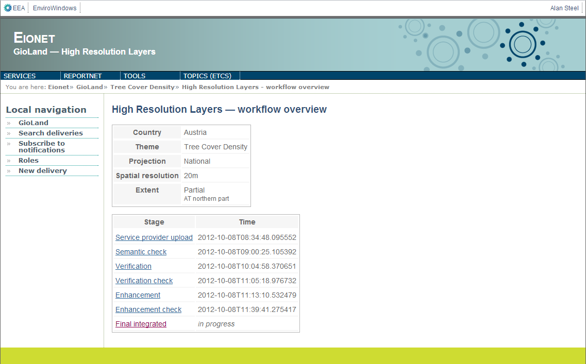
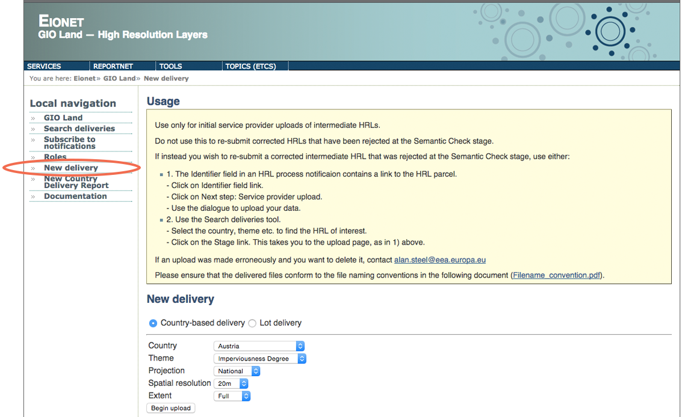
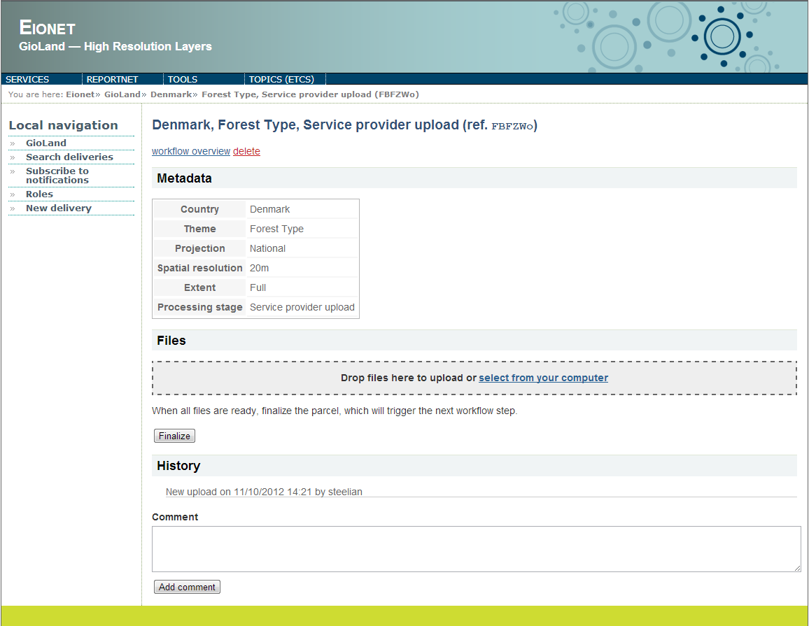

Guide
=====
This document serves to describe the functionality and interface of the
portal.

It is an extension of the EIONET system, and registered users can access
the portal via their EIONET user account.

For further clarification, please contact Alan.Steel@eea.europa.eu.

http://gaur.eea.europa.eu/gioland/

Login
~~~~~
Access is restricted to registered GIO land stakeholders.

Local Navigation
~~~~~~~~~~~~~~~~
The Local navigation menu bar (left side of the page) accesses the main
portal functions:

* Subscribe to notifications
* Search deliveries
* New delivery

Notifications
~~~~~~~~~~~~~
Notifications serve to inform users about verification and enhancement
actions on HRLs that are of specific interest.

Select the ‘Subscribe to notifications’ option under Local navigation.

This will open a dialogue which allows users to subscribe to receive HRL
notifications. Keep the default options, which are set to 'Any', to
receive all HRL notifications, or filter notifications by Country,
Theme, Extent, Projection, Spatial resolution, processing Stage and
Event type.

In this way, when HRL Verification and Enhancement activities matching
these criteria occur, the user will receive a notification by email.

The notification email gives details of who submitted what and when, and
a URL link to the event page.

Overview of deliveries
~~~~~~~~~~~~~~~~~~~~~~
Select the ‘Search deliveries’ option under Local navigation. This takes
the users to a table of all deliveries made. Users can filter the table
for deliveries of specific interest. Once found, clicking on the Stage
link takes the user to the most current stage of that delivery - e.g.
Final integrated.

At the top of the delivery page is the ‘workflow overview’ link, which
you can follow to view previous stages in the workflow of this
deliverable.

New delivery
~~~~~~~~~~~~
The ‘New delivery’ option is available only to Service Providers,
allowing them to initiate the upload of a new HRL into the Verification
and Enhancement stages. New deliveries must be labelled by Country,
Theme, Extent, Projection, Spatial resolution and Extent (full country
coverage or partial coverage). Clicking on the 'Begin Upload' button
takes you to the upload page. Select the criteria from the dropdown
lists that match the HRL to be uploaded.

Service Providers can drag and drop, or select HRL archives files from
their computers for upload. When the archive is uploaded, clicking on
the 'Finalise' button will trigger the next workflow step and
notifications will be sent to any users who have subscribed to receive
them. Users can add text in the Comment box if they choose.

